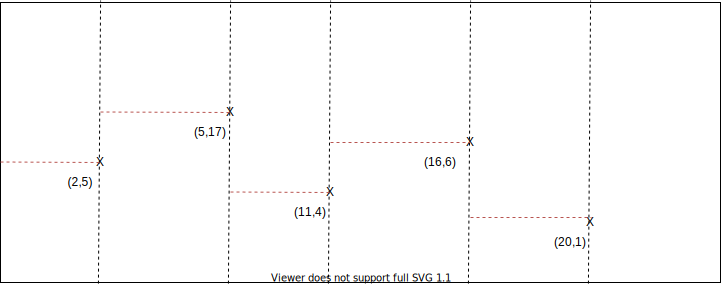

# TP1 Divide and Conquer

## Author

* Selim Lakhdar <selim.lakhdar@gmail.com> <selim.lakhdar.etu@univ-lille.fr>

## Divide

Si on découpe notre problème suivant le nombre de points on obtient plusiers zones de la forme:
```
 [ 
    [0, x1],
    [x1, x2],
    [x2, x3],
    .....
    [x(n-1), x(n)] ou [x(n), l] si on a encore de l'espace
  ] 
```

Sachant que pour chaque zone on peut avoir deux rectangle de la forme:
```
  [ [x1, 0], [x2, y2] ] et [ [x1, 0], [x2, h] ] 
```

On obtient ne première liste de rectangles:
```
 [ 
    [ [[0,  0], [x1, y1]] ,  [ [[0, 0], [x1, h] ]], 
    [ [[x1, 0], [x2, y2]] ,  [ [x1, 0], [x2, h] ]],
    [ [[x2, 0], [x3, y3]] ,  [ [x2, 0], [x3, h] ]], 
    .....
    [ [x(n-1), 0], [x(n-1), y(n-1)] , [x(n-1), 0], [x(n-1), h] ]
        ou
    [ [xn, 0], [xn, h] ] si on a encore l'espace 
  ] 
```

## Merge

Il nous suffit de parcourir le tableau en fussionant deux à deux les zones. Cette opération va nous retourner la concatenation des 4 rectangles possibles pour chaque deux zones.

Ici on essaie de fusioner :
```
    [[0, 0], [x1, y1]] avec [[x1, 0], [x2, y2]] et [ [x1, 0], [x2, h] ]
    [[0, 0], [x1, h]]] avec [[x1, 0], [x2, y2]] ,  [ [x1, 0], [x2, h] ]
```

### Fusion

```
# take highest y
if int(r1y2) > int(r2y2):
    tmp += [[[r1x1, r1y1], [r2x2, r2y2]]]
else:
    tmp += [[[r1x1, r1y1], [r2x2, r2y2]]]
```


## Exemple



### Divide:

```
[
    [ [[0,0],[2,5]], [[0,0],[2,20]] ] 
    [ [[2,0],[5,17]], [[2,0],[5,20]] ] 
    [ [[5,0],[11,4]], [[5,0],[11,20]] ] 
    [ [[11,0],[16,6]], [[11,0],[16,20]] ] 
    [ [[16,0],[20,1]], [[16,0],[20,20]] ] 
    [ [[20,0],[25,20]] ] 
]
```
fusion deux à deux
```
[
    [ [[0,0],[5,5]] ] 
    [ [[2,0],[11,4]], [[2,0],[11,17]] ] 
    [ [[5,0],[16,4]] ] 
    [ [[11,0],[20,1]], [[11,0],[20,6]] ] 
    [ [[16,0],[25,1]] ] 
]
```

fusion deux à deux
```
[
    [ [[0,0],[11,4]] ] 
    [ [[2,0],[16,4]] ] 
    [ [[5,0],[20,1]] ] 
    [ [[11,0],[25,1]] ] 
]
```

fusion deux à deux
```
[
    [ [[0,0],[16,4]] ] 
    [ [[2,0],[20,1]] ] 
    [ [[5,0],[25,1]] ] 
]
```

fusion deux à deux
```
[
    [ [[0,0],[20,1]] ] 
    [ [[0,0],[25,1]] ] 
]
```

fusion deux à deux
```
[
    [ [[0,0],[25,1]] ] 
]
```