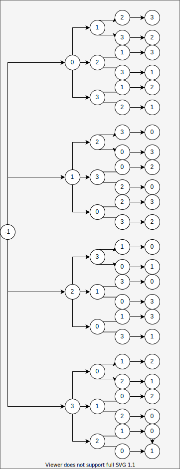
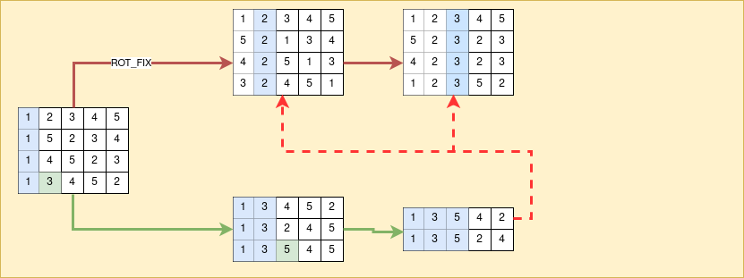

# TP4 Heuristique

## Author

* Selim Lakhdar <selim.lakhdar@gmail.com> <selim.lakhdar.etu@univ-lille.fr>

## Evaluation

```
def eval_solution(tasks):
    score = 0
    curr_time = 0
    for t in tasks:  # task[0]: task duration, task[1]: importance, task[2]: max wait
        curr_time += t[0]
        wait = max(curr_time - t[2], 0)
        score += wait * t[1]
    return score
```


## Neighbors

- Si on prend les pos des taches:

| | pos |
|:----: | :----: |
| t1 | 0 |
| t2 | 1 |
| t3 | 2 |
| t4 | 3 |

- on consruit:

  

- Utilisation de **multiset_permutations**, de la bibliothèque **Sympy**.  

``` 
[0, 1, 2, 3]
[0, 1, 3, 2]
[0, 2, 1, 3]
[0, 2, 3, 1]
[0, 3, 1, 2]
[0, 3, 2, 1]
[1, 0, 2, 3]
[1, 0, 3, 2]
[1, 2, 0, 3]
[1, 2, 3, 0]
[1, 3, 0, 2]
[1, 3, 2, 0]
[2, 0, 1, 3]
[2, 0, 3, 1]
[2, 1, 0, 3]
[2, 1, 3, 0]
[2, 3, 0, 1]
[2, 3, 1, 0]
[3, 0, 1, 2]
[3, 0, 2, 1]
[3, 1, 0, 2]
[3, 1, 2, 0]
[3, 2, 0, 1]
[3, 2, 1, 0]
```

## Heuristiques Constructives

- Algo glouton

```
def sort_by_exec_time(tasks):
    ind = np.argsort(tasks[:, 0])
    return ind


def sort_by_importance(tasks):
    ind = np.argsort(tasks[:, 1])
    return ind
    
eval_solution(tasks[sort_by_importance(tasks)])
eval_solution(tasks[sort_by_exec_time(tasks)])
```

## LocalSearch

``` 
def heuristique_local_search(tasks):
    ind = sort_by_importance(tasks)
    best_score = eval_sol.eval_solution(tasks[ind])
    print("init pos: " + str(ind))
    print("init score: " + str(best_score))
    # taking first 10 neighbors, Mouvemebt: First improvement
    for perm in multiset_permutations(ind[:10]):
        new_ind = np.append(perm, ind[10:].reshape(-1, 1))
        score = eval_sol.eval_solution(tasks[new_ind])
        if score < best_score:
            best_score = score
            print("new best score found: " + str(best_score))
            print(new_ind)
    return
```


## HillClimbing
``` 
def heuristique_hill_climbing(tasks):
    ind = sort_by_importance(tasks)
    best_score = eval_sol.eval_solution(tasks[ind])
    print("init pos: " + str(ind))
    print("init score: " + str(best_score))
    for i in range(2, len(tasks)):
        print("i: " + str(i) + ", perm: " + str(ind[:i]))
        for perm in multiset_permutations(ind[:i]):
            new_ind = np.append(perm, ind[i:].reshape(-1, 1))
            score = eval_sol.eval_solution(tasks[new_ind])
            if score < best_score:
                best_score = score
                print("new best score found: " + str(best_score))
                print(new_ind)
    return
```

## VND

    

## ILS
``` 
def heuristique_ils(tasks):
    best_score, ind = heuristique_local_search(tasks)
    historique = {str(ind): best_score}
    while True:
        np.random.shuffle(ind)
        if str(ind) not in historique:
            new_score, ind = local_search(ind, tasks, best_score)
            historique[str(ind)] = best_score
            if new_score < best_score:
                best_score = new_score
```


## TODO: Campaign