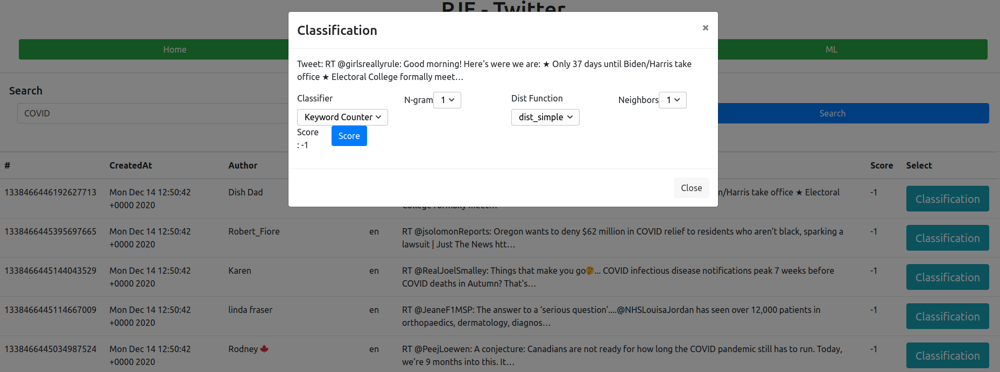

# PJE: Twitter Sentiment Analysis

## Author:

* Selim Lakhdar <selim.lakhdar.etu@univ-lille.fr> <selim.lakhdar@gmail.com>

## Architecture

### Flowchart


### Use Case

- L'utilisateur récupère les tweets à partir du frontend via un formulaire.
    - Chaque résultat de requete est stocker dans un fichier csv.
- L'utilisateur classifie un tweet suivant les différents algo implémenté. La classification se déroule comme suit:
    - L'utilisateur envoie une req de classification au backend. (tweet, classifieur, classifieur_params)
    - Le backend exécute un script python qui est associé au classifieur avec les bon param via une méthode
      ScriptRunner(script).
    - Le résultat est retourné à l'utilisateur.

### Microservices

- L'architecture adoptée est sous forme de micro-service, ce qui permet de dissocier chaque partie.
- Chaque service est indépendant des autres, ce qui facilite le debug et la taulérance aux fautes (dans l'absolue).

#### Frontend

- Utilisation du framework React pour la vue (GUI).
- React a été privilégié aux autres framework (Angular) pour sa fluidité/rapidité.

#### Backend

- Utilisation de Golang pour le serveur (RESTFul API).
- Golang a été privilégié aux autres technologies existantes (NodeJS, Java) pour plusieurs raisons:
    - Plus rapide (comparé à Java).
    - Typée (comparé à NodeJS).
    - Supporte de gros flux de donnée grâce aux mécanismes de GOroutines (*)
- Plusieurs ressources disponibles sur le web.

#### Database

- Utilisation de simple fichiers csv pour stocker les tweets.

#### MachineLearning

- L'implémentation des algo a été faite en Python.
- Python est plus pratique que Golang pour ce genre d'opération. (ie: opération sur les chaines de caractères)
- Ne pas avoir de monolithe !!!
    - Le backend est juste responsable d'exécuter des scripts, et renvoie le résultat.
    - Si le script crash, le backend tourne toujours .....

## Twitter API

- L'API Twitter a été utilisé à travers un module Golang: github.com/dghubble/go-twitter/twitter

## Base d'apprentissage

### Data

- La première base utilisée pour la classification, a été celle fournie (positive/negative words).
    - Plusieurs problèmes dû à l'encodage du fichier.
    - (Au final j'ai du les réécrire à la main ....)
- Dans la suite j'ai pu récupérer une base proposée par stanford qui contient 1.6M tweet;
    - 800K tweet positif
    - 800K tweet négatif
- De plus, j'ai pu retrouver une base de test, qui contient 500 tweets annoté;
    - positif, négatif, neutre

### Preprocessing

- Afin de nettoyer la base de tweet, plusieurs regex ont été utilisé (voir scripts/ml/tweet_parser.py:100) :
    - Suppression des URLs
    - Suppression des mentions (@....)
    - Suppression des hashtag (#....)
    - Suppression des RT (RT .....)
    - Suppression des emojis
    - Suppression des nombres
    - Suppression des ponctuation
    - Suppression des espaces

## Classification

### Overview

- Les classifeurs suivent la forme des cassifieurs de scikit:
    - Méthode fit(x_train, y_train), pour fitter les données
    - Méthode predict(x_test), pour prédire la classe d'une liste de tweet.
- Cette approche générique m'a facilité la tâche lors de la cross validation (voir scripts/ml/cross_validation.py:64)
- Les algo maintiennent un dictionnaire de mots, avec leur fréquence (pas pour KNN).
- Le découpage de mot est pris en compte (gram(s)). L'indexation se fait sous la forme:

```
word1_word2_..._wordn: 42 
```

### Keywords

- Les premières versions se basaient sur la liste de pos/neg words proposée.
- Par la suite, j'ai utilisé la fonction fit, qui prend en argument une base de training (X,y):
    - Pour chaque tweet d'une classe, on compte les mots.
    - Une version avec n_gram a été implémenté.

### KNN

#### Fonction de Distance

- Pour la plupart des tests, la fonction de distance utilisé est celle proposé dans le TP.
- Utilisation de l'algo de levenshtein (trop couteux en temps ....)

#### Paramètres

- L'algo prend en compte K voisins.
- L'algo ne prend pas en compte les "grams".

### Bayes

#### Presence & Frequence

- Implémentation de la classification par présence et fréquence.
- Construction des mots suivant "ngrams".
- Utilisation d'un threshold de 0.1 pour classifier un tweet en tant que neutre
    - ie: si (score_pos - score_neg) < 0.1: classer en tant que neutre.

## Résultat

- Afin de faciliter (diminuer) le calcul, j'ai utilisé le base de test qui contient 500 tweet.

### Cross Validation

- Afin d'avoir un score "plus exacte" (généralisé) qu'une simple évaluation, on utilise la cross validation.
- Implémentation de la cross validation (voir scripts/ml/cross_validation.py)
- implémentation de la matrice de confusion. (calcul de TP,FP, TN,FN)
    - calcul des scores:
        - Accuracy
        - Precision
        - Recall
        - F1_score

### Keyword Classification Results

| grams | min_word_length | accuracy_score | f1_score |
| ----------- | ----------- | ----------- | ----------- |
| 1 | 1 | 0.6999369155412704 | 0.5061803091827464 |
| 1 | 2 | 0.7170335882476663 | 0.525628834504957 |
| 1 | 3 | 0.7244857531209081 | 0.5308719280433171 |
| 2 | 1 | 0.8522086897680801 | 0.7011918795757759 |
| 2 | 2 | 0.8802605025763566 | 0.7215645968002843 |
| 2 | 3 | 0.8830767876546208 | 0.725381709556842 |
| 3 | 1 | 0.8570823145533393 | 0.7063454441308844 |
| 3 | 2 | 0.8890001032553891 | 0.7319790848912777 |
| 3 | 3 | 0.8887314028494954 | 0.7316904591108964 |
| 4 | 1 | 0.850671683410716 | 0.6924654553781053 |
| 4 | 2 | 0.8883580459703355 | 0.8883580459703355 |
| 4 | 3 | 0.8884060920851251 | 0.7316162484575377 |

### Bayes Presence Classification Results

| grams | min_word_length | accuracy_score | f1_score |
| ----------- | ----------- | ----------- | ----------- |
| 1 | 1 | 0.5914686975871339 | 0.4324815057495264 |
| 1 | 2 | 0.5916653600386469 | 0.4348433862826341 |
| 1 | 3 | 0.5913816605564748 | 0.43302334923240443 |
| 2 | 1 | 0.5914737818208675 | 0.43317273666034695 |
| 2 | 2 | 0.5914922048088883 | 0.4349208851258032 |
| 2 | 3 | 0.5909359458831062 | 0.43201363773889784 |
| 3 | 1 | 0.5911890257972707 | 0.4287473048945875 |
| 3 | 2 | 0.5913839200673231 | 0.43445324203921964 |
| 3 | 3 | 0.5915609753217785 | 0.43520398715391495 |
| 4 | 1 | 0.5914955294246819 | 0.4351180765230378 |
| 4 | 2 | 0.5914669475678604 | 0.4321220528935973 |
| 4 | 3 | 0.5854633958129062 | 0.43073713249116474 |

### Bayes Frequency Classification Results

| grams | min_word_length | accuracy_score | f1_score |
| ----------- | ----------- | ----------- | ----------- |
| 1 | 1 | 0.5733615539183858 | 0.396890414930358 |
| 1 | 2 | 0.6046909714402652 | 0.4194792816282645 |
| 1 | 3 | 0.5587119302839954 | 0.3724975271004859 |
| 2 | 1 | 0.5742836614420355 | 0.3852478957203076 |
| 2 | 2 | 0.5855963370955751 | 0.4133397132889919 |
| 2 | 3 | 0.5666453752344771 | 0.35867235991979257 |
| 3 | 1 | 0.5656692297924026 | 0.36665687434390765 |
| 3 | 2 | 0.5518445572615606 | 0.3349228108425881 |
| 3 | 3 | 0.568934617589463 | 0.386496653861183 |
| 4 | 1 | 0.608004375931402 | 0.4258310306526833 |
| 4 | 2 | 0.5675067656138857 | 0.388755540408001 |
| 4 | 3 | 0.5759993786538513 | 0.3862269903398137 |

### KNN Classification Results

| neighbors | accuracy_score | f1_score | 
| ----------- | ----------- | ----------- |
| 1 | 0.6610482754002489 | 0.4999099134274979 |
| 5 | 0.6743617353129054 | 0.5137821118454071 |
| 10 | 0.6788151448842902 | 0.5258397204881505 |
| 15 | 0.6646689630677747 | 0.5060514997615895 |


## Conclusion

- On remarque que le keyword classifier réussi à mieux classer les tweets lorsque l'on augmente le nombre gram, et en excluant le plus possible de "petit" mot.
- **Bizarrement** le bayes classifier n'a pas de bon score ....
  - le classifier par presence, arrive péniblement à un score de 0.6 avec un score f1 assez médiocre ....
  - le classifier par frequence, n'obtient pas de meilleur résultat, à part pour:
    - grams: 4
    - min_world_length: 1
- Le classifier KNN, obtient de bon résultat lorsqu'on augmente le nombre de voisins


## Usage

```
docker-compose build backend
docker-compose up backend
```

## Screens




