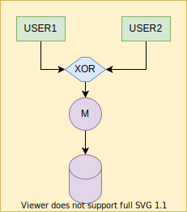
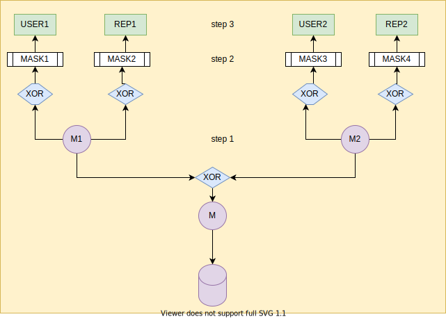

## Author

- ABDULLAH Mohamad <mohamad.abdullah.etu@univ-lille.fr>
- LAKHDAR Selim <selim.lakhdar.etu@univ-lille.fr>

# Part I

- On utilise XOR pour créer le mdp final.
- Pour la 2FA on split notre clé sur 2. Une partie sera gardé par l'utilisateur, l'autre sera chiffré dans une clé USB.   

# Part II & III

## step 1
- On génère M1 et M2.
- On XOR M1 et M2 pour avoir M qui servira à crypter notre BDD.
- On chiffre grâce à l'algorithme AES.

## step 2
- Pour chaque utilisateur on génère un mask.

## setp 3
- On XOR le mask avec M{1/2} pour chaque groupe/user
- On obtient une clé pour cette user. 

## Revocation

- La révocation se fait simplement. 
- Il nous suffit de supprimer le mask de l'utilisateur concerné (après que les ayants droits se soient connectés) 
