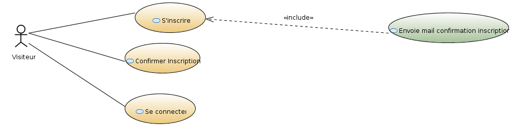
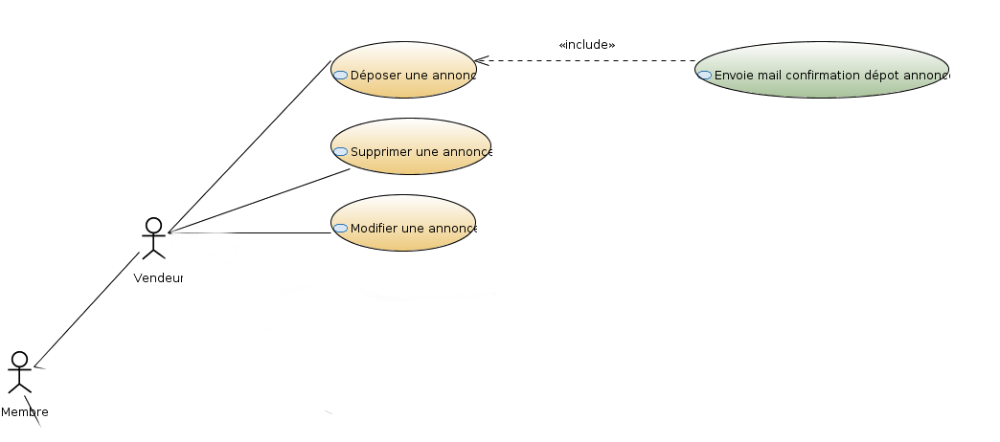
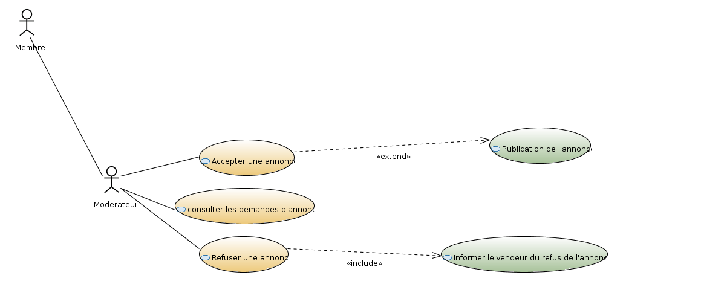
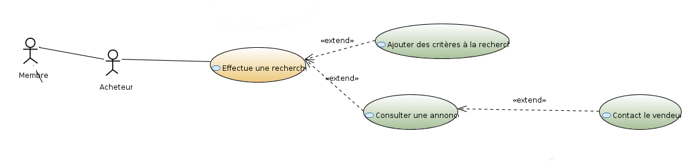
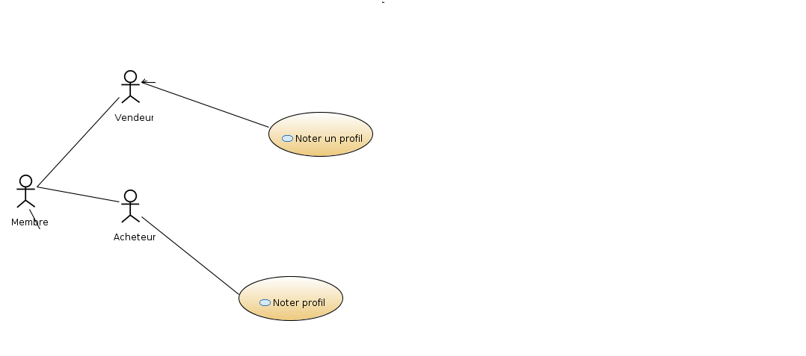
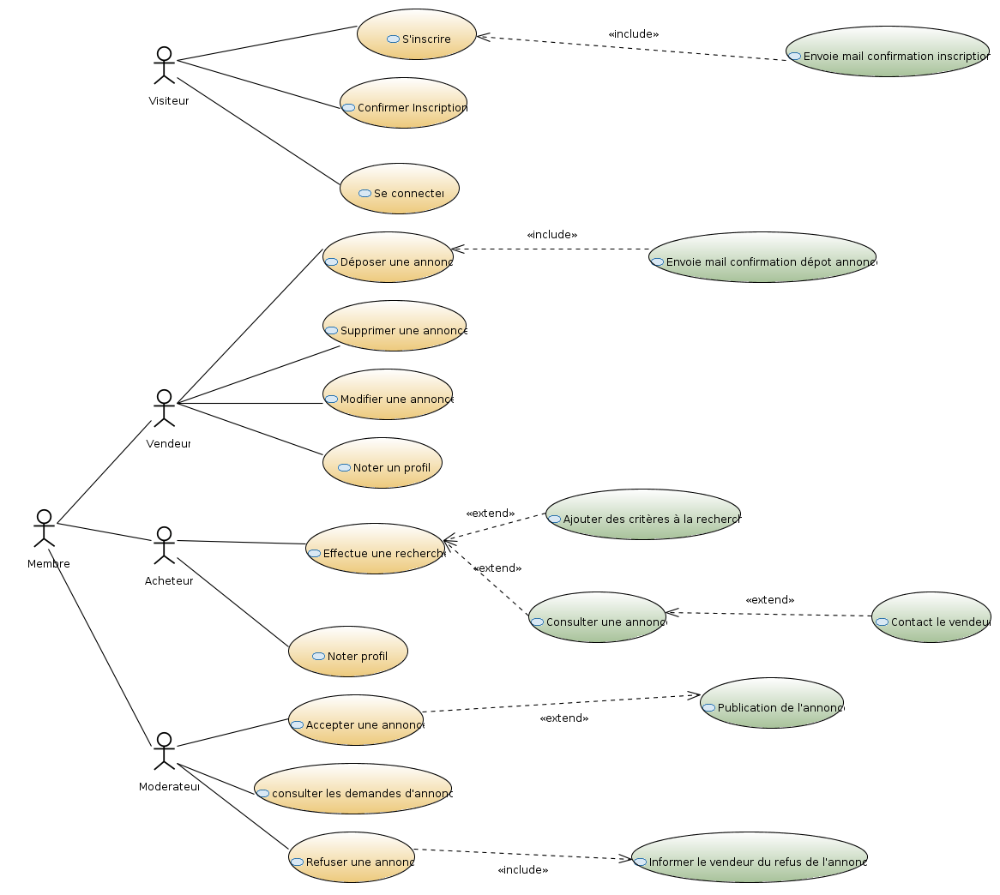
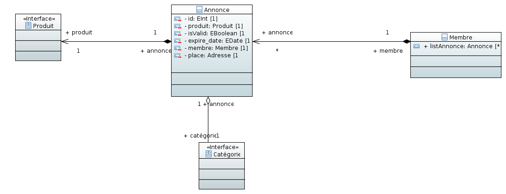

Sujet 1 - Petites annonces
===============

- Groupe _5_ (Enseignant _Giuseppe Lipari_)  

### Équipe 3:
 * Dambrine Valentin
 * Deregnaucourt Benjamin
 * Lakhdar Selim
 * Oswalt Rémi
 * Soleillet Jonathan

### Versions
- Version: 1.0 - 15/09/2017
- Version: 2.0 - 04/10/2017
- Version: 3.0 - 12/10/2017

# I. Introduction generale #

- Pourquoi cette application ?

  Cette application est née du besoin d'avoir une plate-forme de revente entre particuliers de façon sécurisée et simple, en cherchant autour de chez soi en priorité.

- Quels sont ses caractéristiques principales ?

  L'application permet la création, la consultation et la gestion de petites annonces entre particuliers en proposant un système de réputation sur les profils.

- Quels sont les objectifs ?

  Les objectifs sont donc la mise à disposition d'outils pour mettre en avant les produits que les utilisateurs veulent vendre.

# II. Scénarios concrets #

## 1. Acheteur
-------------

Eudes, un collectionneur de jeux rétro utilise régulièrement MaBrocrante pour trouver des nouveaux produits dans le but d'étoffer sa collection, profitant de la
naïveté des vendeurs du site pour obtenir des raretés à moindre coût.  
Cependant une des ses consoles rétro a cessé de fonctionner il y a peu, il cherche désormais à s'en procurer une nouvelle via le site, le marché étant relativement restreint pour ce type de produit.  
Au cours de ses recherches, il tombe sur l'annonce de Théo, un jeune homme qui cherche à vendre la vieille console de son père en parfait état, ne connaissant pas beaucoup le marché et ne s'étant pas renseigné, il met un prix très inférieur aux prix habituels pour ce type de produit.
Eudes se connecte et, voyant une opportunité d'économiser une belle somme, se décide à contacter immédiatement Théo en cliquant sur le bouton "me contacter" présent sur l'annonce.  
Après quelques mails envoyés, ils se mettent d'accord pour un rendez-vous dans le but de conclure la vente.  
Quelques jours plus tard, Eudes se rend chez Théo et fait l'acquisition dudit produit, il possède désormais une toute nouvelle console quasiment neuve au détriment du jeune Théo qui pense avoir vendu l'objet à un prix convenable.
Si l'achat est concluant il devra noter le profil du vendeur.

## En résumé

En tant que visiteur,  
Je peux m'inscrire sur le site,  
Afin de contacter un vendeur dans l'optique de réaliser un achat.

## 2. Vendeur
-------------

Guillaume veut vendre ses posters de Francis Lalanne. Il veux publier une annonce sur le site MaBrocrante.Il clique sur déposer une annonce.Comme il n'est pas membre, il dois se créer un profil.
Pour créer son profil le site lui demande via un formulaire plusieurs informations :
  - nom
  - prenom
  - adresse mail
  - mot de passe
Ensuite on lui envoie un mail de confirmation, il clique sur le lien contenu dans cet e-mail pour activer son compte.
Il accède au formulaire pour demande de dépôt d'annonce, il dois saisir plusieurs informations :
- Le nom de l'annonce ou l'objet qu'il vend
- Une description de l'objet la plus complète possible
- Le prix auquel il désire le vendre
- Le lieu où se trouve l'objet
- Si l'objet peut être envoyé ou remis en main propre
- Plusieurs photos (non obligatoire)
- Au minimum un moyen de contact (numéro de téléphone ou adresse e-mail).

Il attend la confirmation d'un modérateur de la validité de l'annonce.
Guillaume sera contacté par mail ou par téléphone par un potentiel acheteur avec lequel ils se mettrons en accord.
Si la vente est concluante il devra supprimer son annonce et noter le profil de l'acheteur.

## En résumé

En tant que visiteur,  
Je peux m'inscrire sur le site,  
Afin de déposer une annonce.

## 3. Modération d'une petite annonce.
------------------------------

Thierry est éditeur et modérateur de MaBrocante et veut contrôler les annonces des utilisateurs et vendeurs.

Il clique sur 'espace de modération'. Il voit la liste des annonces publiées par les vendeurs et pour chacun consulte l'annonce proposée en cliquant dessus.

Si il juge qu'une annonce est correctement renseignée, il clique sur le bouton "Accepter" et elle est maintenant affichée publiquement.

En consultant une seconde annonce, il juge qu'elle commet des manquements à la charte de Ma Brocante et que l'annonce contient des erreurs ne pouvant la faire accepter. Ainsi il précise les détails du refus dans un champ de texte destiné à être envoyé au vendeur, puis clique sur le bouton "Refuser".

### En résumé
En tant que modérateur,  
Je peux accepter ou refuser des annonces en attente de publication  
Afin de publier des annonces conformes à la charte du site.

## III. Cas d'utilisations ##

* **NB: direction de la flêche include et extends**
* **NB: utiliser la technique CRUD pour generaliser les CUs**
* **NB: eliminer "Publication de l'annonce", c'est le même que AcceptetAnnonce**
* **NB: effectuer une recherche et consulter annonce ne sont pas forcement liée**

### 1. Inscription
#### 1. Description du cas d'utilisation :
Un visiteur peut s'inscrire pour déposer une annonce, ou pour contacter un vendeur.
#### 2. Diagrammes de CUs.

------------------------------
### 2. Ajout/Suppression/Modification d'annonce :
#### 1. Description du cas d'utilisation :  
Le vendeur peut ajouter, modifier, supprimer ses annonces.
#### 2. Diagrammes de CUs.

------------------------------
### 3. Consulter/Accepter/Refuser annonce :
#### 1. Description du cas d'utilisation :
Le modérateur liste les annonces en attente de validation, puis les accepter ou les refuser.
#### 2. Diagrammes de CUs.

------------------------------
### 4. Effectuer recherche
#### 1. Description du cas d'utilisation :
L'acheteur ou le visiteur peuvent effectuer une recherche avec ou sans critère précis pour trouver une annonce.
#### 2. Diagrammes de CUs.

------------------------------
### 5. Noter un profil
#### 1. Description du cas d'utilisation :
L'acheteur ou le vendeur peut noter après un achat ou une vente, le profil de l'acheteur/vendeur.
#### 2. Diagrammes de CUs.

---------------------

#### Cas d'usages global de l'application :

## Diagrammes des Classes ##

Une représentation des classes du système

### 1. Classe Membre/Profil/Adresse

Représente un membre du système (utilisateur ou modérateur), utilisé lors de l'inscription.  
Un modérateur, est un membre qui a le token isAdmin.

### 2. Classe Profil Réputation

Représente le système de réputation. Chaque profil possède une réputation basée sur son score global (score d'achat + score de vente).
Plusieurs récompenses sont attribuées en fonction d'un palier.

### 3. Interface Produit

Interface produits qui propose une implémentation globale de la représentation d'un produit.
Cette interface devra être enrichie dans les sous classes.

### 4. Classe Annonce

Représente une annonce dans le système.  
Un membre possède, aucune ou plusieurs annonces, et une annonce et rattachée à un membre.   
Une annonce contient un produit, qui est défini par l'interface Produits.   
Une annonce appartient à une catégorie.

## Packetage ##

Il faut separer les classes en "Packets", selon la méthodologie vue en
cours (par couches, ou par fonctionnalités, etc.)

## Glossaire métier ##

Acheteur : Utilisateur inscrit sur le site ayant pour vocation la consultation ou l'achat d'un produit mis en vente.

Modérateur : Utilisateur inscrit responsable de la validation des annonces soumises sur le site.

Vendeur : Utilisateur inscrit sur le site ayant pour vocation la vente d'un produit sur le site.

Visiteur : Utilisateur lambda qui utilise le site sans être connecté, sans bénéficier des avantages d'un utilisateur inscrit.
