Sujet 1 - Petites annonces
===============

- Groupe _5_ (Enseignant _Giuseppe Lipari_)  

### Équipe 3:
 * Dambrine Valentin
 * Deregnaucourt Benjamin
 * Lakhdar Selim
 * Soleillet Jonathan

### Versions
- Version: 1.0 - 15/09/2017
- Version: 2.0 - 04/10/2017
- Version: 3.0 - 12/10/2017
- Version: 4.0 - 16/11/2017

# I. Introduction generale #

- Pourquoi cette application ?

  Cette application est née du besoin d'avoir une plate-forme de revente entre particuliers de façon sécurisée et simple, en cherchant autour de chez soi en priorité.

- Quels sont ses caractéristiques principales ?

  L'application permet la création, la consultation et la gestion de petites annonces entre particuliers en proposant un système de réputation sur les profils.

- Quels sont les objectifs ?

  Les objectifs sont donc la mise à disposition d'outils pour mettre en avant les produits que les utilisateurs veulent vendre.

# II. Scénarios concrets #

## 1. Acheteur
-------------

Eudes, un collectionneur de jeux rétro utilise régulièrement MaBrocrante pour trouver des nouveaux produits dans le but d'étoffer sa collection, profitant de la
naïveté des vendeurs du site pour obtenir des raretés à moindre coût.  
Cependant une des ses consoles rétro a cessé de fonctionner il y a peu, il cherche désormais à s'en procurer une nouvelle via le site, le marché étant relativement restreint pour ce type de produit.  
Au cours de ses recherches, il tombe sur l'annonce de Théo, un jeune homme qui cherche à vendre la vieille console de son père en parfait état, ne connaissant pas beaucoup le marché et ne s'étant pas renseigné, il met un prix très inférieur aux prix habituels pour ce type de produit.
Eudes se connecte et, voyant une opportunité d'économiser une belle somme, se décide à contacter immédiatement Théo en cliquant sur le bouton "me contacter" présent sur l'annonce.  
Après quelques mails envoyés, ils se mettent d'accord pour un rendez-vous dans le but de conclure la vente.  
Quelques jours plus tard, Eudes se rend chez Théo et fait l'acquisition dudit produit, il possède désormais une toute nouvelle console quasiment neuve au détriment du jeune Théo qui pense avoir vendu l'objet à un prix convenable.
Si l'achat est concluant il devra noter le profil du vendeur.

## En résumé

En tant que visiteur,  
Je peux m'inscrire sur le site,  
Afin de contacter un vendeur dans l'optique de réaliser un achat.

## 2. Vendeur
-------------

Guillaume veut vendre ses posters de Francis Lalanne. Il veux publier une annonce sur le site MaBrocrante.Il clique sur déposer une annonce.Comme il n'est pas membre, il dois se créer un profil.
Pour créer son profil le site lui demande via un formulaire plusieurs informations :
  - nom
  - prenom
  - adresse mail
  - mot de passe
Ensuite on lui envoie un mail de confirmation, il clique sur le lien contenu dans cet e-mail pour activer son compte.
Il accède au formulaire pour demande de dépôt d'annonce, il dois saisir plusieurs informations :
- Le nom de l'annonce ou l'objet qu'il vend
- Une description de l'objet la plus complète possible
- Le prix auquel il désire le vendre
- Le lieu où se trouve l'objet
- Si l'objet peut être envoyé ou remis en main propre
- Plusieurs photos (non obligatoire)
- Au minimum un moyen de contact (numéro de téléphone ou adresse e-mail).

Il attend la confirmation d'un modérateur de la validité de l'annonce.
Guillaume sera contacté par mail ou par téléphone par un potentiel acheteur avec lequel ils se mettrons en accord.
Si la vente est concluante il devra supprimer son annonce et noter le profil de l'acheteur.

## En résumé

En tant que visiteur,  
Je peux m'inscrire sur le site,  
Afin de déposer une annonce.

## 3. Modération d'une petite annonce.
------------------------------

Thierry est éditeur et modérateur de MaBrocante et veut contrôler les annonces des utilisateurs et vendeurs.

Il clique sur 'espace de modération'. Il voit la liste des annonces publiées par les vendeurs et pour chacun consulte l'annonce proposée en cliquant dessus.

Si il juge qu'une annonce est correctement renseignée, il clique sur le bouton "Accepter" et elle est maintenant affichée publiquement.

En consultant une seconde annonce, il juge qu'elle commet des manquements à la charte de Ma Brocante et que l'annonce contient des erreurs ne pouvant la faire accepter. Ainsi il précise les détails du refus dans un champ de texte destiné à être envoyé au vendeur, puis clique sur le bouton "Refuser".

### En résumé
-----------------------------
En tant que modérateur,  
Je peux accepter ou refuser des annonces en attente de publication  
Afin de publier des annonces conformes à la charte du site.

## 4. Le système de réputation
-----------------------------

Jacques a réussi à revendre moult outils de bricolage dont il ne se servait plus depuis quelques années. Ses clients ayant tous étaient satisfaits des délais de livraison, de la conformité des produits par rapport à leur description dans leurs annonces respectives, ainsi que de la politesse de Jacques, ils n'ont pas hésité à lui donner une note positive sur son profil Membre.  

La réputation de Jacques augmente donc, permettant à ses autres annonces de gagner en visibilité, en les positionnant dans les premiers résultats renvoyés lors d'une recherche.

### En résumé
-----------------------------

En tant que membre,
Je peux noter un profil
Afin d'attester de sa fiabilité.

# III. Cas d'utilisations

## 1. Visiteur

Un visiteur est un utilisateur lambda qui utilise le site sans être connecté, sans bénéficier des avantages d'un utilisateur inscrit.
Il peut choisir de s'inscrire pour devenir un membre.
Il peut confirmer son inscription et se connecter pour accéder aux fonctionnalités d'un membre.
Il peut aussi effectuer une recherche d'annonces et si il le désire consulter une annonce.

#### 1. Diagrammes de CUs.

------------------------------
## 2. Membre

Un membre du site peut être vendeur ou acheteur. Il a donc accès à différentes fonctionnalités du site :

Il peut contacter un autre membre dans le but d'acquérir un objet ou juste pour une demande d'information ou d'aide.

Il peut noter un profil d'un autre membre (après une vente le vendeur notera le profil de l'acheteur et l'acheteur notera le profil du vendeur).  

Il peut gérer ses annonces :
 - Consulter une de ses annonces
 - Modifier une annonce
 - Supprimer une annonce
 - Ajouter une annonce

#### 1. Diagrammes de CUs.
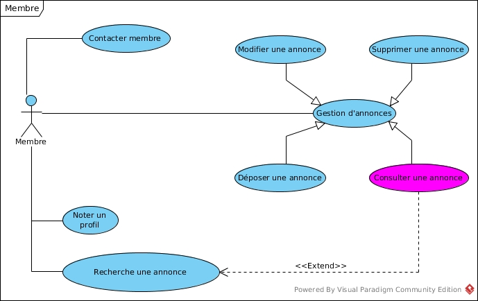

------------------------------
## 3. Modérateur

Le modérateur est un utilisateur inscrit responsable de la validation des annonces soumises sur le site.
Il peut consulter les annonces en attente de validation puis il choisit :
  - D'accepter l'annonce, un mail informe le membre de l'acceptation de son annonce
  - De refuser l'annonce, il devra expliquer la raison du refus, le membre sera informé par mail du refus.

#### 1. Diagrammes de CUs.

**[NOTE] mettez la bonne fleche entre les acteurs (heritage)**

---------------------

### Cas d'usages global de l'application :

# IV. Diagrammes des Classes

Une représentation des classes du système

### 1. Classe Membre/Profil/Adresse

Représente un membre du système (utilisateur ou modérateur), utilisé lors de l'inscription.  
Un modérateur, est un membre qui a le token isAdmin.

### 2. Classe Profil Réputation

Représente le système de réputation. Chaque profil possède une réputation basée sur son score global (score d'achat + score de vente).
Plusieurs récompenses sont attribuées en fonction d'un palier.

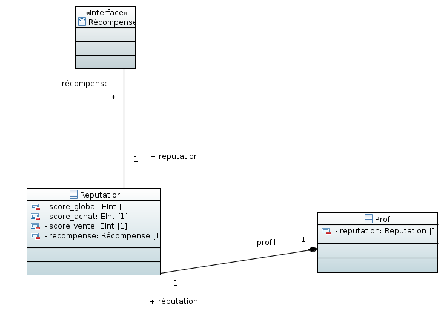

**[NOTE il est utilisé ou ?**

### 3. Interface Produit

Interface produits qui propose une implémentation globale de la représentation d'un produit.
Cette interface devra être enrichie dans les sous classes.

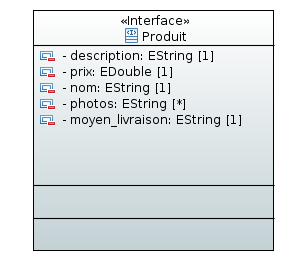

**[NOTE] ce n'est pas une interface**
** Si c'est une classe abstrait, quel sont les classe derivée?**

### 4. Classe Annonce

Représente une annonce dans le système.  
Un membre possède, aucune ou plusieurs annonces, et une annonce et rattachée à un membre.   
Une annonce contient un produit, qui est défini par l'interface Produits.   
Une annonce appartient à une catégorie.

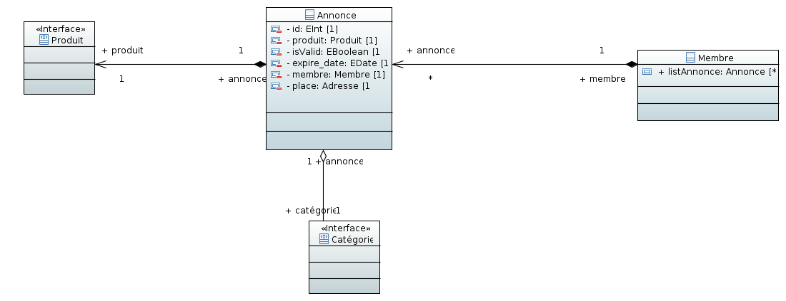

**[NOTE] la classe Categorie, quel est la taxonomie des catégories possibles ? Quel methodes il expose ? **
**[NOTE] Attention au fleches**
**[NOTE] attention au losanges (l'association simple est sans aucun losange**

# V. Classement des cas d'usages

| Cas d'usage | MOA | Risque | Somme |
|--------|:-----:|:--------:|:-------:|
|  ***Gestion d'annonce***  <ul> Ajouter une annonce </ul> <ul> Modifier une annonce</ul> <ul> Supprimer une annonce</ul> | 5 | 4 | 9 |
|**Recherche d'annonce** | 5 |5 |10|
|**Modération d'annonce**|4|4|8|
|**Inscription**|3|2|5|
|Connexion|3|2|5|
|**Éditer le profil**| 1| 1|2|
|**Contacter membre**|1|1|2|
|Noter le profil|1|1|2|

**[REMARQUE] il manque la justification du tableau, pourquoi vous avez classé comme ça ?**

# VI. Description détaillée #

__Nom du cas__    : Recherche d'annonce  
__Résumé__        : Un visiteur ou membre désire trouver un objet sur Mabrocante, il effectue une recherche avec ou sans critère(s).  
__Acteur__        : Visiteur ou membre  
__Précondition__  : aucune  
__Déclenchement__ : choisit d'acheter un objet  
__Scénario Nominal__ :  
  1. Le visiteur ou le membre désire effectuer une recherche
  2. Le système affiche un formulaire de recherche  
  3. Le visiteur ou le membre remplit le formulaire de recherche
  4. Le système valide le formulaire de recherche
  5. Le système construit la liste d'annonces correspondant à la recherche
  6. Le système affiche les résultats de la recherche   

__Scénarios alternatifs__ :  

  - 4.a [Formulaire invalide]
    - 4.a.1 Le système affiche les champs invalide
    - 4.a.2 Retour à 3
  - 5.a [Aucune annonce correspondant au(x) critère(s)]  
    - 5.a.1 Le système affiche pas de résultat  
    - 5.a.2 retour à 2

----------------

__Nom du cas__    : Inscription  
__Résumé__        : S'inscrire sur le site  
__Acteur__        : Visiteur  
__Précondition__  : aucune  
__Déclenchement__ : choisir de s'inscrire

__Scénario Nominal__ :  
  1. Le visiteur désire s'inscrire sur le site
  2. Le système affiche un formulaire d'inscription
  3. L'utilisateur remplit le formulaire d'inscription
  4. Le système valide les informations du formulaire d'inscription
  5. Le système ajoute le nouveau membre à MaBrocrante
  6. Appel au CU EnvoieMailConfirmationInscription

__Scénarios alternatifs__ :   
  - 4.a [Formulaire invalide]
    - 3.a.1 Le système affiche les champs invalide du formulaire
    - 3.a.2 Retour à 2  

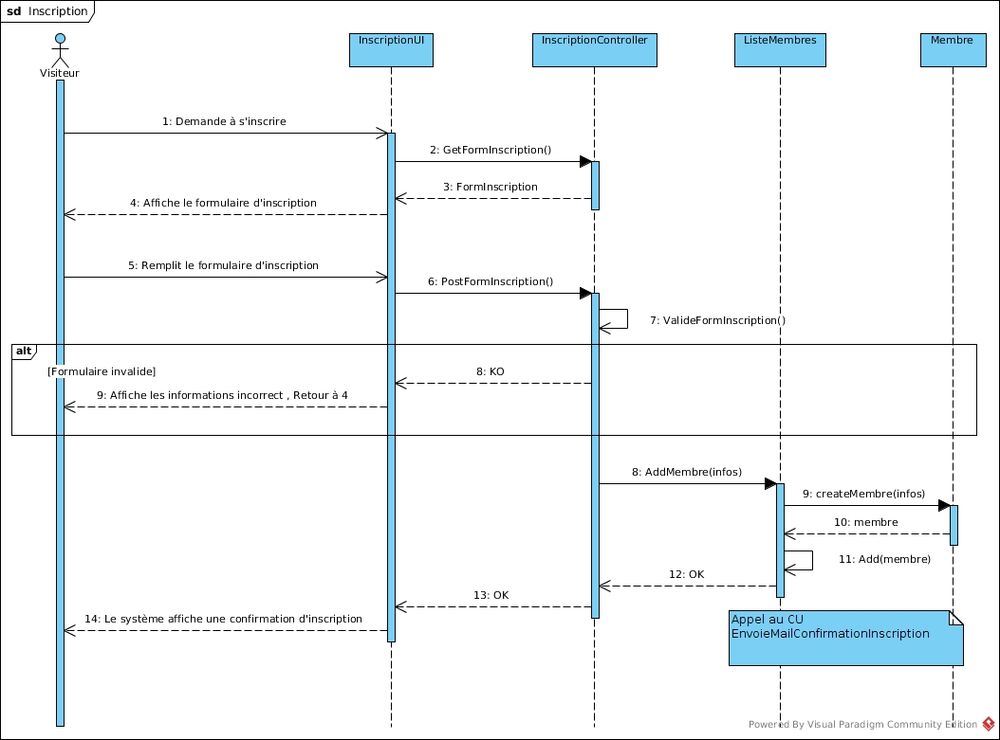

**[NOTE] Gerer la creation plus correctement**
----------------

__Nom du cas__ : Validation  
__Résumé__ : Valider son inscription  
__Acteur__ : un visiteur  
__Précondition__ : s'inscrire  
__Déclenchement__ : confirmation de l'inscription  
__Scénario Nominal__ :  
  1. Le systeme envoie un mail de confirmation à l'utilisateur
  2. L'utilisateur valide son inscription
  3. Le systeme accepte la validation du compte  

__Scénarios alternatifs__ :   
  - 2.a [L'utilsateur ne valide pas son inscription]  
	- 5.a.1 Après un temps le systeme supprime le compte

----------------

__Nom du cas__    : Création une annonce  
__Résumé__        : vendre un objet  
__Acteur__        : un membre  
__Précondition__  : Être membre  
__Déclenchement__ : choisit de vendre un objet  
__Scénario Nominal__ :  
  1. l'utilisateur demande la création d'annonce
  2. le système affiche le formulaire de création    
  3. l'utilisateur remplit le formulaire
  4. le systeme valide le formulaire
  5. le système crée l'annonce  
  6. le système renvoi la notification
  7. le système appel le CU envoie mail confirmation annonce  
  8. fin CU  

__Scénarios alternatifs__ :  
  - 4.a [formulaire invalide]  
    - 4.a.1 le systeme affiche un message d'erreur
    - 4.a.2 retour à 1

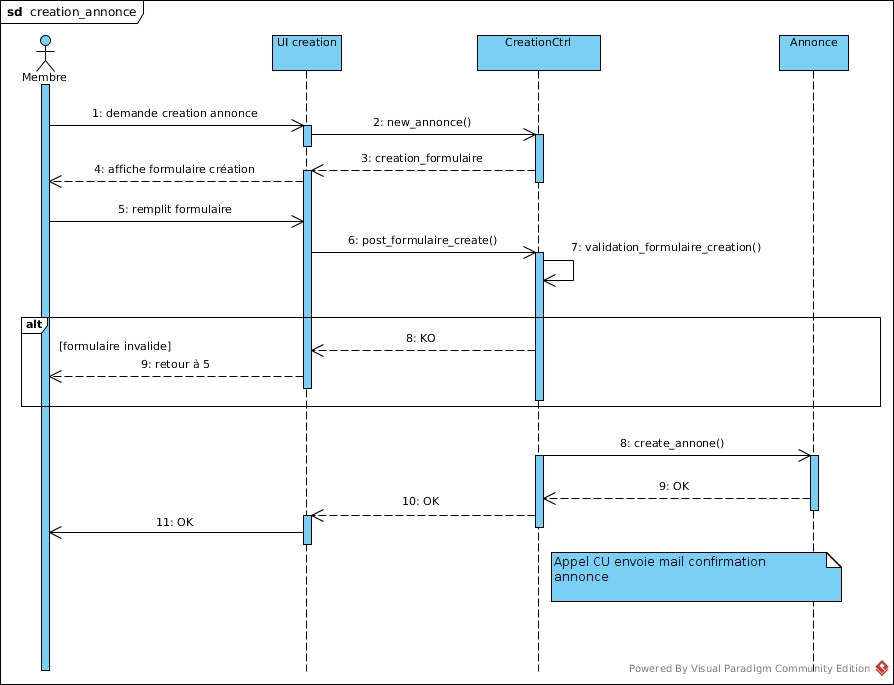

----------------

__Nom du cas__    : suppression d'une annonce  
__Résume__        : Supprimer une annonce  
__Acteur__        : un membre  
__Precondition__  : Être membre  
__Déclenchement__ : le membre choisit de supprimer son annonce

__Scénario nominale__ :
  1. l'utilisateur choisit l'annonce à supprimer à partir de son profil
  2. le système affiche un formulaire pour demander la cause de la suppression, et demande la confirmation
  3. l'utilisateur confirme la suppression et inscrit la raison de la suppression
  4. le système sauvegarde la raison
  5. le système supprime l'annonce de la base de donnée
  6. fin de CU

__Scénarios alternatifs__ :  
  - 3.a. [formulaire incomplet - pas de raison précisée]  
    -  3.a.1 le système n'interdit pas la suppression sans cause  
    -  3.a.2 continue à 5
  - 3.b [formulaire incomplet - pas de confirmation]
    - 3.b.1 le système interdit la suppression sans confirmation  
    - 3.b.2 retour à 2  

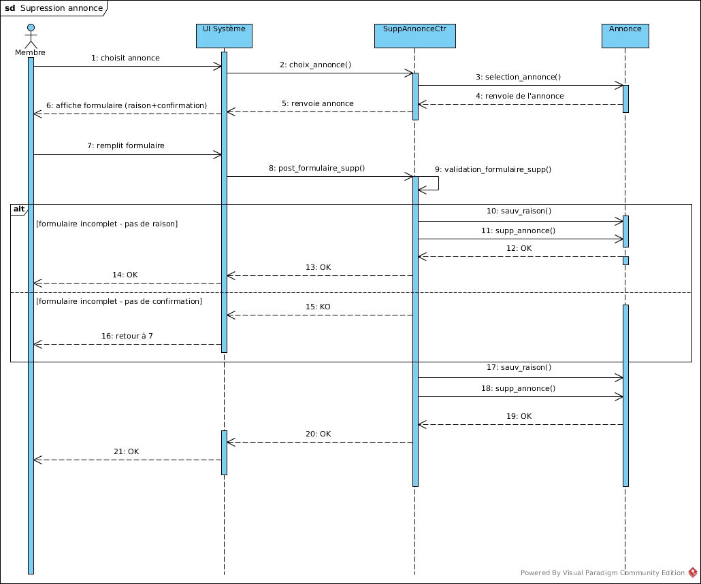

------------------------

__Nom du cas__    : modification d'une annonce  
__Résume__        : modifier une annonce  
__Acteur__        : un membre  
__Precondition__  : Être membre  
__Déclenchement__ : le membre choisit de modifier son annonce

__Scénario nominale__ :
  1. l'utilisateur choisit l'annonce à modifier à partir de son profil
  2. le système affiche le formulaire de création d'une annonce déjà remplit avec les informations du vendeur
  3. l'utilisateur apporte les modifications souhaitées et valide
  4. le système demande une confirmation pour la modification
  5. l'utilisateur confirme
  6. le système valide le formulaire de modification
  7. Le système modifie les informations de l'annonce et la remet en attente de validation
  8. le système envoie une notification à l'utilisateur (popup) afin de lui signaler que son annonce a bien été modifiée et qu'elle est en attente de validation
  9. fin de CU

__Scénarios alternatifs__ :
  - 5.a. [l'utilisateur ne confirme pas]  
    -  5.a.1 le système interdit les modifications  
    -  5.a.2 revient 1
  - 6.a. [formulaire incomplet]  
    -  6.a.1 le système interdit les modifications et affiche les erreurs  
    -  6.a.2 revient à 3
  - 6.b. [formulaire inchangé]  
    -  6.b.1 le système envoie une notification (popup) afin de prévenir l'utilisateur que son annonce n'a pas été changé  
    -  6.b.2 fin CU

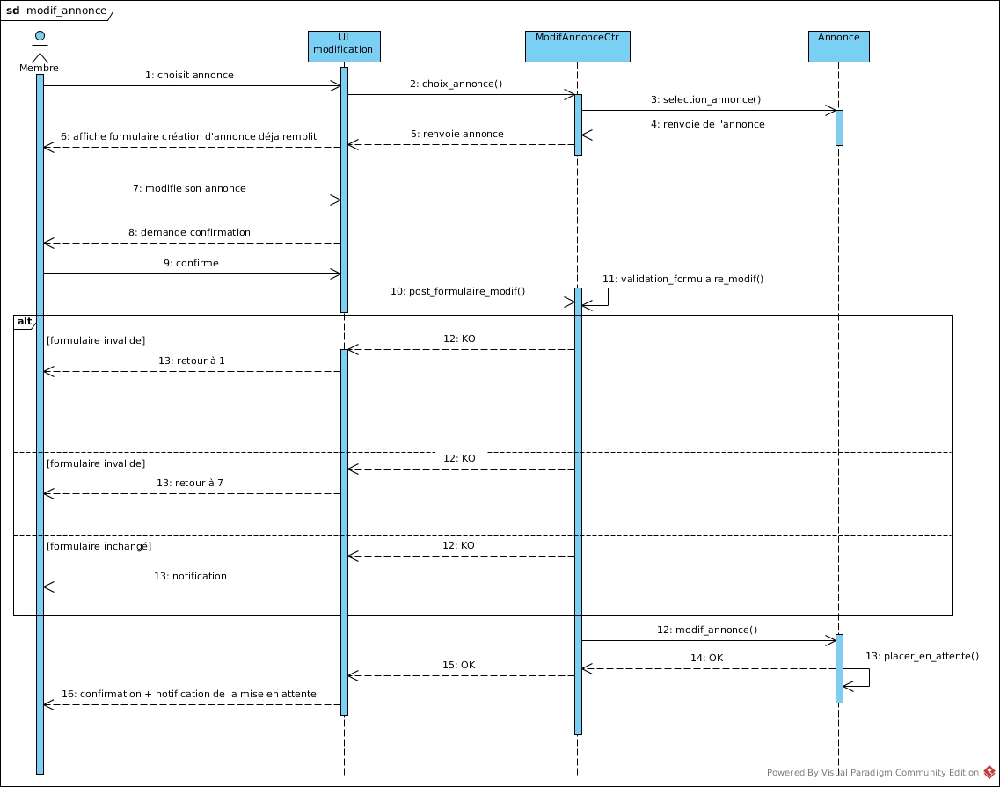

------------------

__Nom du cas__    : Moderation  
__Résumé__        : gerer les annonces du site  
__Acteur__        : Moderateur  
__Précondition__  : aucune  
__Déclenchement__ :  
__Scénario Nominal__ :  
1. le modérateur accède aux annonces non valides
2. le modérateur valide l'annonces
3. appel CU envoie mail annonce active
4. fin CU

__Scénario Alternatif__ :  
  - 2.a. [Modérateur refuse l'annonce]  
  - 3.a. appel CU envoie mail annonce refusé
  - 4.a fin CU

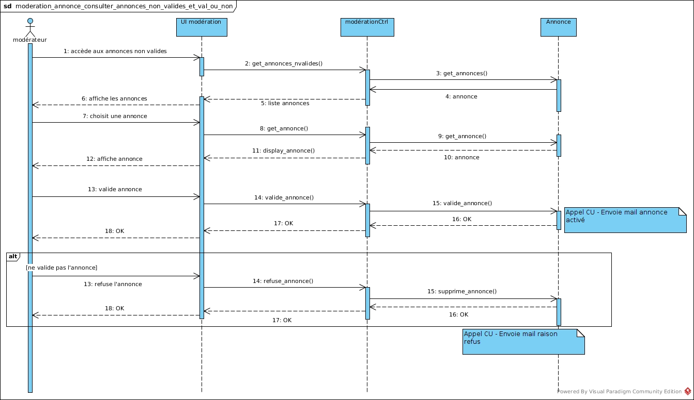

--------------

__Nom du cas__ : Contacter membre  
__Résumé__ : L'acheteur veux se mettre en relation avec le vendeur afin d'acheter l'objet ou d'obtenir plus d'information sur l'objet.  
__Acteur__ : Membre  
__Précondition__ :Le membre dois être connecter sur Mabrocante  
__Déclenchement__ : Le membre décide de contacter le vendeur de l'annonce qu'il consulte.  
__Scénario Nominal__ :  
1. L'acheteur demander à contacter le vendeur de l'annonce
2. Le système demande comment l'acheteur veux contacter le vendeur
3. L'utilisateur choisit le moyen de contact (envoie d'un message interne)
4. Le système valide le moyen de contact
5. Le système affiche un formulaire
6. L'acheteur précise la raison du contact, ainsi qu'une description de sa demande
7. Le système valide les informations rentrés par l'acheteur
8. Le système envoie le message de l'acheteur au vendeur de l'annonce
9. Le système envoie un message de confirmation à l'acheteur
10. Fin de C.U

__Scénario Alternatif__ :  
  - 2.a. [Moyen de contact téléphone]  
    - 2.a.1. Le système affiche le numéro de téléphone du vendeur.  
    - 2.a.2. Aller à (10)  

  - 2.b. [Moyen de contact adresse mail]  
    - 2.b.1. Le système affiche un lien permettant d'envoyer un e-mail au vendeur.(lien mail-to)  
    - 2.b.2. Aller à (10)  

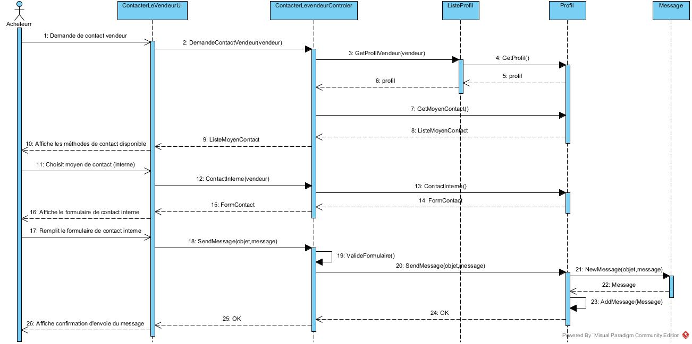

----------

__Nom du cas__ : Editer le profil   
__Résumé__ : L'utilisateur veux modifier les informations de son profil.  
__Acteur__ : Membre  
__Précondition__ :Le membre dois être connecter sur Mabrocante  
__Déclenchement__ : Le membre veux modifier les informations de son profil.  
__Scénario Nominal__ :
1. L'utilisateur demande à éditer son profil
2. Le système affiche les informations du profil de l'utilisateur dans un formulaire.
3. L'utilisateur modifie les informations qu'il désire dans le formulaire
4. Le système demande confirmation à l'utilisateur pour la modification de son profil
5. l'utilisateur confirme la modification
6. Le système valide les informations modifiés  
7. Le système modifie les informations du profil
8. Le système informe l'utilisateur du bon déroulement des modifications
9. Fin de C.U

__Scénario Alternatif__ :
  - 3.a. [L'utilisateur ne confirme pas la modification]
    - 3.a.1. Retour à (2)
  - 5.a. [Aucune modification]
    - 5.a.1. Aller à (9)
  - 5.b. [Information(s) non valide(s)]
    - 5.b.1. Le système affiche un message signalant les champs incorrects
    - 5.b.2. Retour à (2)

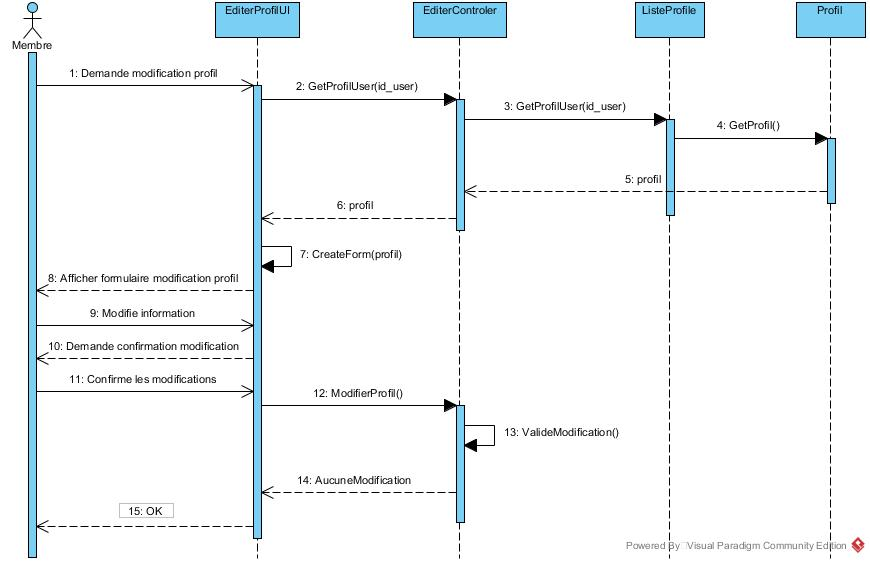
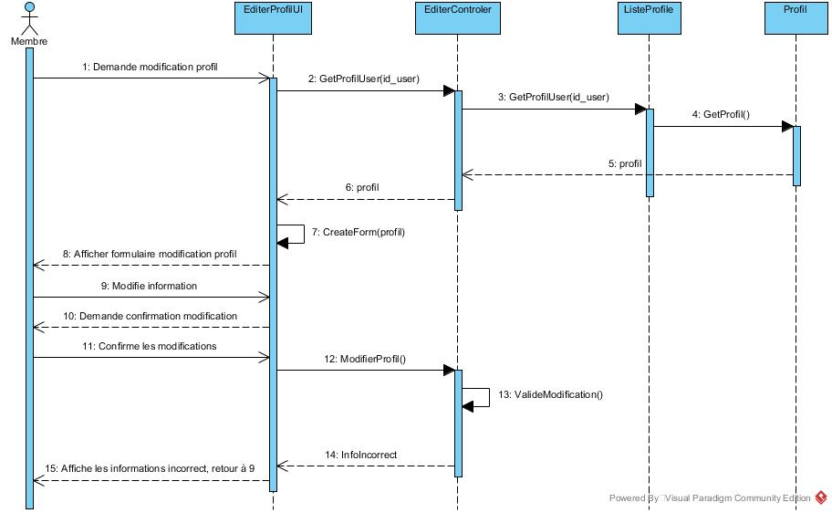

------------

__Nom du cas__ : Noter un profil
__Résumé__ : Un membre peut en noter un autre après un achat afin de témoigner de son bon ou mauvais contact.
__Acteur__ : Membre
__Précondition__ : Le membre doit être connecté sur MaBrocante
__Déclenchement__ : Le membre décide de noter son interlocuteur à la suite d'un achat
__Scénario Nominal__ :
1. Le membre consulte le profil d'un autre membre.
2. Le membre choisit de noter le profil.
3. Le système affiche un formulaire.
4. Le membre précise une note entre 0 et 5, l'annonce par laquelle il a rencontré le membre qu'il note, et un texte libre pour détailler son avis.
5. Le système valide la notation du profil.
6. Le système envoie un message de notification au membre noté.
7. Fin de C.U.

## Architecture

**[NOTE] Faites une seul section avec les paquets**

Architecture Client/Serveur en couches (Modèle / Vue / Contrôleur).

## Packetage

Il faut separer les classes en "Packets", selon la méthodologie vue en
cours (par couches, ou par fonctionnalités, etc.)

## Glossaire métier

Acheteur : Utilisateur inscrit sur le site ayant pour vocation la consultation ou l'achat d'un produit mis en vente.

Annonce : Une annonce est un article dédié à la présentation d'un produit mis en vente sur le site.

Catégorie : Libellé permettant de trier les annonces mises en ligne.

Inscription : Procédure permettant à un visiteur de devenir membre du site.

Membre : Personne inscrite disposant de différentes fonctionnalités sur le site.

Modérateur : Utilisateur inscrit responsable de la validation des annonces soumises sur le site.

Produit : Objet ou service mis en vente sur le site.

Profil : Le profil décrit un utilisateur, en détaillant son pseudonyme, les articles qu'il a mis en vente, sa réputation. Il est également possible d'envoyer un message à un utilisateur depuis son profil, e.g. pour poser une question à propos d'une annonce.

Réputation : Système de points proposés sur le site. Chaque utilisateur a sa propre réputation, basée sur les avis des personnes lui ayant acheté un produit. Selon le score du vendeur, il peut lui être offert des réductions à valoir sur le site ou sur un autre selon les partenaires du site.

Vendeur : Utilisateur inscrit sur le site ayant pour vocation la vente d'un produit sur le site.

Visiteur : Utilisateur lambda qui utilise le site sans être connecté, sans bénéficier des avantages d'un utilisateur inscrit.

**[NOTE] Confusion entre ListeMembres et ListeProfil, essayez d'utiliser une seul liste**

**[NOTE] Developpez la classe message, et lier avec Recompense / Reputation**

**[NOTE] Developpez la partie Reputation, avec des cas d'usage en plus**
