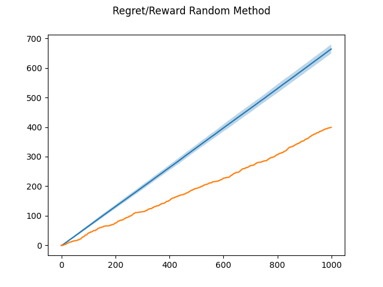
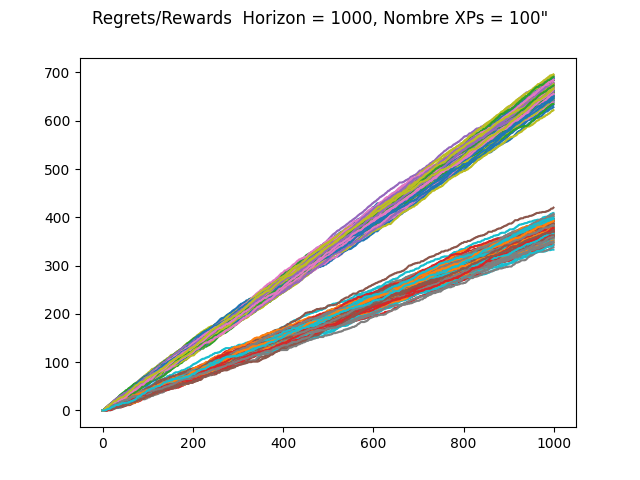
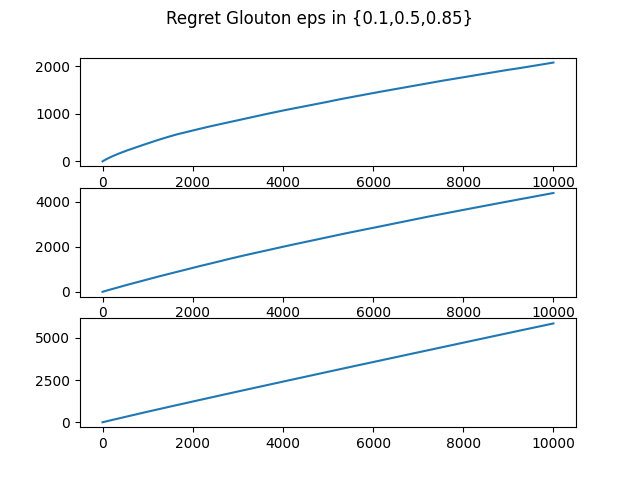
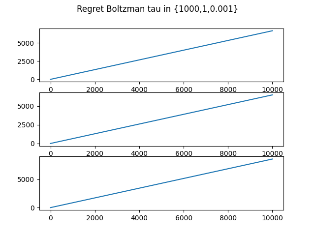
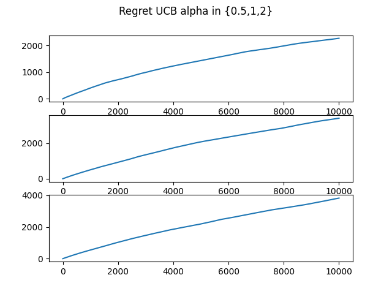
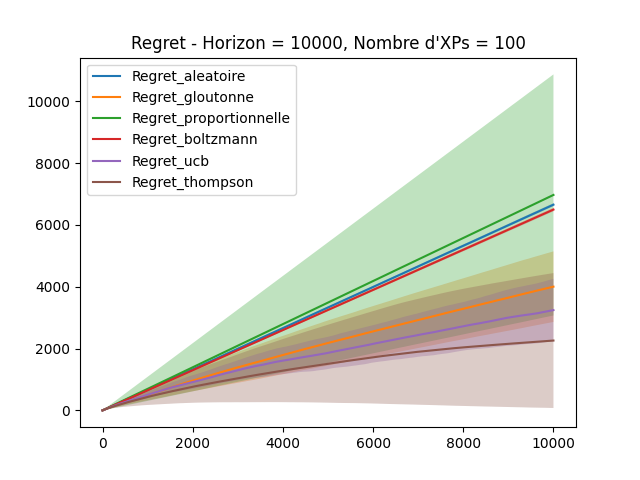

## Compte rendu TP Bandit:
Auteurs: **Akeniouene Abderrahmane & Boutaleb Fouad**

### Première version
---

On peut voir que le regret progresse plus vite que le reward sur notre `horizon` de 10000 et sur `100` expériences.

### Version de travail
---

On peut remarquer que sur les 100 eperiences, les regrets et les rewards suivent plus ou moins la même trajectoire d'une experience à une autre.

### Stratégies gloutonnes
---

La courbe des regrets suivant la stratégie gloutonne progresse moins vite quand `epsilon` vaut `0.1`, car on fait plus d'exploitation que d'exploration.

### Stratégie de Boltzmann
---

Plus la valeur de `tau` est petite plus la progression des regrets augmonte plus vite.

### Stratégie optimiste
---

Ici, avec alpha valant `0.5`, donne de meilleurs résultats que les deux autres valeurs.

### Comparaison générale
---

La méthode la plus satisfaisante est **Thompson**, suivie par **UCB**.
la methode gloutonne a été parametrée avec `epsilon` valant `0.5`, donc mi-exploitation, mi-exploration, si jamais on l'initialise à `1`, sa courbe sera equivalente à celle de la méthode aléatoire.
Pour la **Proportionnelle** et **Boltzmann**, elles suivent plus ou moins l'**Aléatoire**.
