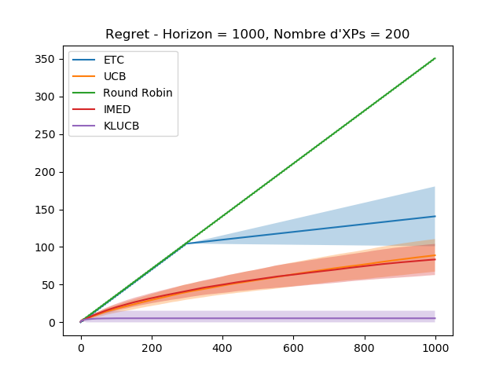

# TP1 Bandits

# Author
- Selim Lakhdar
  - selim.lakhdar.etu@univ-lille.fr
  - selim.lakhdar@gmail.com

# Log
```
Processing ETC
ETC exec time:  0.27819228172302246
Processing UCB
UCB exec time:  2.1804490089416504
Processing Round Robin
Round Robin exec time:  0.16412138938903809
Processing IMED
IMED exec time:  3.4312591552734375
Processing KLUCB
KLUCB exec time:  35.35792112350464
```

# Plot



- On remarque ici que la stratégie Round Robin a un regret qui est supérieur aux autres.
- On remarque que ETC se stabilise après la phase d'exploration, à partir de x=300, et augmente doucement. On remarque aussi qu'elle a une variance qui augmente plus que les autres (lors de la phase d'exploitation).
- On remarque que UCB et IMED sont plus ou moins équivalentes (leurs variances aussi). Les deux courbes croient logarithmiquement
  -  IMED est sensiblement mieux (moins de regret). Mais prend un peu plus de temps que UCB.
- La meilleur stratégie est la KLUCB, dont le regret, est largement inférieur aux autres. Par contre son temps d'exécution est plus long. 

# Conclusion

- KLUCB <<< IMED < UCB << ETC <<<< Round Robin