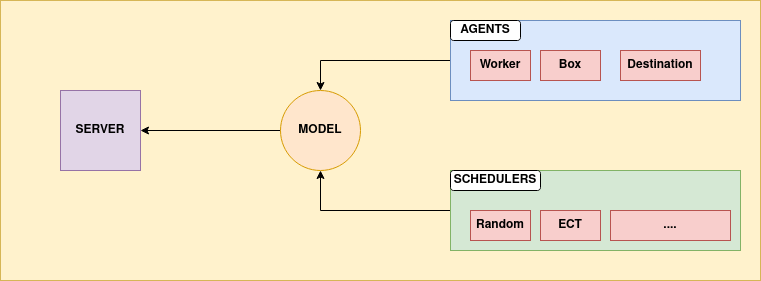
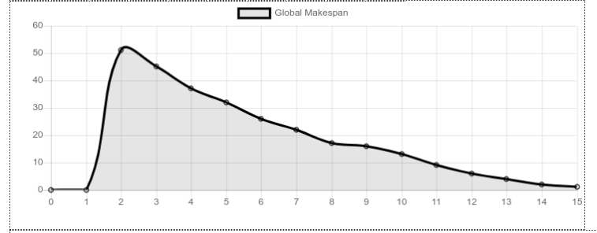
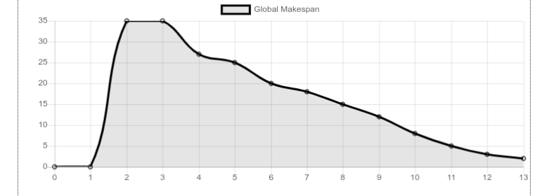
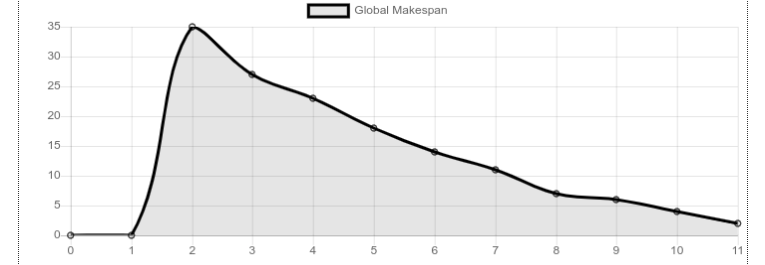
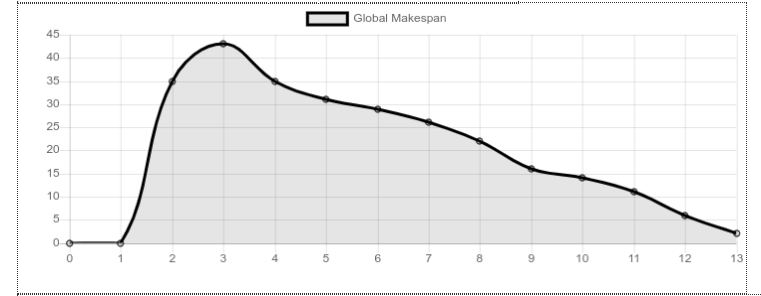
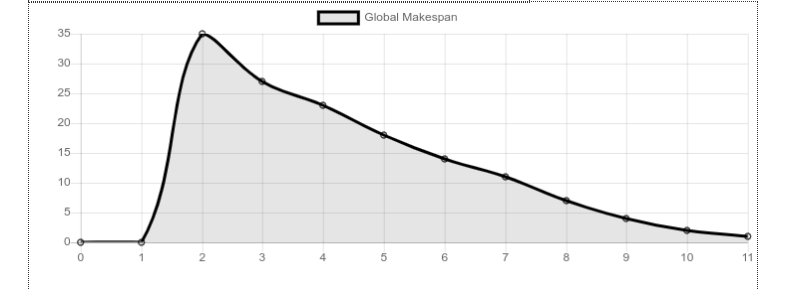

SMA
-----------------------------

# Authors
    - Josue Happe
        - josue.happe.etu@univ-lille.fr
    - Selim Lakhdar
        - selim.lakhdar.etu@univ-lille.fr


# HowTo
```bash
make install
make run
```
### Docker
```bash
docker-compose build
docker-compose up
```

# Architecture



# Implemented Strategies

## Random
Assign a random box to a random worker


## Naive Nearest Neighbors
Init assignation with a greedy strategy. Associate largest boxes to largest workers first !  
Reallocate boxes to nearest neighbors. Naive implementation, don't take in account other worker !



## ECT
Earliest Completion Time. Brute Force !!



## Negotiation 1
Init assignation with a greedy strategy. Associate largest boxes to largest workers first !  
At each step, worker_i{..n-1} negotiate box with worker_i+{1..n} to reduce individual makespan



## Heuristique 1
Take boxes with lowest id first with nearest worker.  
