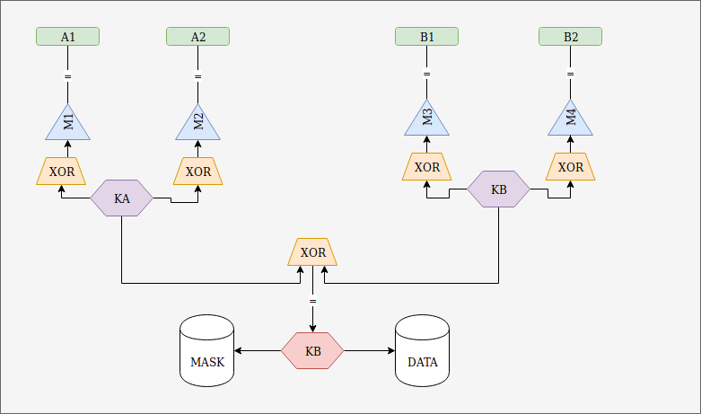

Soleillet Jonathan  
Lakhdar Selim  
Cra

---------------------

# Lancer le poc
  - Lancer et réinialiser le poc :
  ```
  ./init.sh && ./poc.sh | ./server.sh
  ```

  - Lancer sans réinialiser le poc : (Après un exit)
  ```
   ./poc.sh | ./server.sh
  ```

# Commandes disponible

```
start <user1> <user1_key> <user2> <user2_key>  
get <name>
add <name> <data>
add_user <user1> <user1_key> <user2> <user2_key> <new_username> <groupe>  
rm_user <user1> <user1_key> <user2> <user2_key> <user_to_rm>
exit
```

Les utilisateurs par défaut sont : Alice et Bob  
Et les clés par défauts portent le même nom que l'utilisateur et sont stockés dans le dossier user/username/username.key  

Add_user : Il est nécessaire de donner les crédentials de A et B ainsi que le nom du nouvel utilisateur et d'indiquer le groupe (0 pour gauche (Coté de Alice) ou 1 pour droite (Côté de Bob)).

# Example d'utilisation

```
./init.sh && ./poc.sh | ./server.sh
start Alice Alice Bob Bob
get toto
add titi 123456789
get titi
add_user Alice Alice Bob Bob charlie 1
rm_user Alice Alice Bob Bob Bob
exit
```

# Arboressence, clés et masques


On retrouvera dans le dossier serveur plusieurs dossiers :
  - Le dossier DB : Il fait office d'une base de données.  
      A l'intérieur on y retrouvera :
      - le dossier data : Contient les fichiers chiffrer de tous les données pour chaque utilisateurs
      - le dossier auth : Contient la liste des masques autorisé à se connecter. Il est nécessaire de pouvoir déchiffer ce fichier pour ajouter ou retirer des utilisateurs.
  - Le dossier mask : Contient l'ensemble des mask autorisés à se connecter, on utilise ses fichiers pour les combiner avec la clé correspondante fournis par l'utilisateur.

La clé K qui permet de chiffer la base de données (data et auth) est obtenu gràce à la formule suivante : (Exmple avec Alice = A1 et Bob = B2)

1. On génère une clé KA et KB
2. On génère un masque pour A1 (M1)
3. On XOR KA et le masque et on obtient la clé pour A1
4. On génère un masque pour A2 (M2)
5. On XOR KB et le masque et on obtient la clé pour A1
6. On XOR KA et KB pour obtenir K

Voir image ci-dessus.
