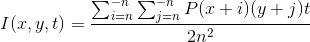
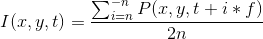

19/10/2018

###  TODO

<table>
    <thead>
        <tr>
            <th>Spatial</th>
            <th>Spatiotemporal</th>
            <th>Post-trtmnt</th>
        </tr>
    </thead>
    <tbody>
        <tr>
            <td>carré2  </td>
        </tr>
        <tr>
            <td>x,y constant</td>
            <td>x,y constant / carré</td>
            <td>cubique</td>
        </tr>
        <tr>
            <td>seuil</td>
        </tr>
    </tbody>
</table>

Spatial + Temporal :  

Temporal :  

