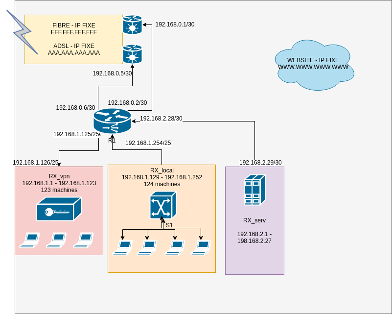

TP1 - ARX
---------------------

Binomes :  
* Selim Lakhdar
* Jonathan Soleillet

------------------------

#### Architecture

La connexion internet est assuré par les deux box (Fibre & ADSL) qui sont connectées au routeur R1. Nous avons choisi de créer 2 sous réseaux pour chacune des box, contenant 2 adresses (une pour le routeur et une pour la box).
Ce routeur décidera grâce à une régle de routage le bon chemin de sortie (la meilleure box).
Ce routeur est aussi relié à 3 autres réseaux :
- RX_local : réseau local contenant les postes de l'entreprise (30 machines). Nous avons choisit un sous réseau de 124 machines pour une future extension. Ces machines sont interconnectées via un switch S1 qui garantit la communication entre elles. S1 est aussi connecté au routeur R1 ce qui permet un accés internet pour ce réseau. Cependant les connexions entrantes sont bloquées grâce au NAT présent sur les box.
- RX_vpn : Ce réseau dispose d'un serveur VPN et il est accessible grâce à une régle NAT sur les box (translation d'adresse via un port). RX_vpn garantit un accés sécurisé aux machines interne de l'entreprise et uniquement au serveur web du réseau 
RX_serv par VPN grâce au routeur R1. Ce réseau pourra accueillir 123 machines.
- RX_serv : réseau comportant 30 adresses. Les connexions entrantes sont bloquées grâce aux règles NAT des box. Il est accessible uniquement via les machines du réseau local (RX_local) et du réseau VPN (RX_vpn). 

Nous utiliserons des régles de filtrages (iptables) pour :
- Accepter que les connexions web vers le serveur local à partir du réseau vpn.
- Accepter toutes les connexions entrantes à partir de RX_local vers RX_serv.
- Les services ftp,ssh,mail,ping... sur le site vitrine ne seront accessibles que si l'IP source correspond à l'une des IP fixe de l'entreprise. 

| Matériel       |     Prix     |
| :------------ | :-------------: |
| Routeur       |     1500     |
| Switch     |   1000    |
|         |     0000      |

Matériel :

https://www.tp-link.com/uk/products/details/cat-4909_TL-ER6120.html#overview  
https://static.tp-link.com/2018/201809/20180914/1910012466_TL-ER6120_UG.pdf  
http://www.cisco.com/c/en/us/products/routers/rv320-dual-gigabit-wan-vpn-router/index.html  

