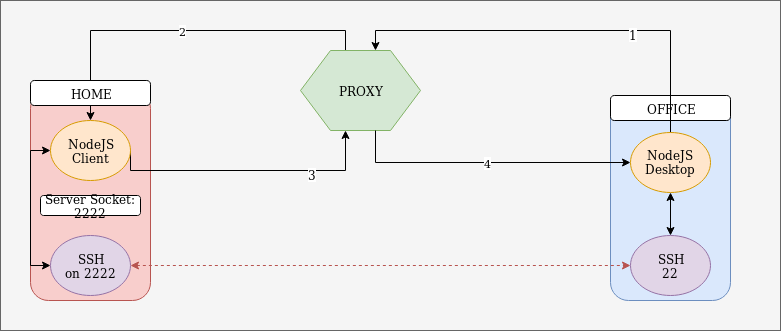

TP Proxy Vs Tunnel
===========================

* Selim Lakhdar
* Jonathan Soleillet

## Proxy
Nous avons utilisé le proxy SQUID avec une configuration qui n'accepte que les connexions sur le port 80.
Nous avons désactivé la method CONNECT pour bloquer les connexions "normales" d'un porxy.

## Tunnel
Pour avoir un lien nous devons initier la connexion à partir du desktop (depuis l'entreprise).

### Office (Entreprise)
Lancer l'application avec l'adresse IP du client ainsi que le port.

1) Envoie d'une requête HTTP au client à intervalle aléatoire.  
2.1) Si res.code == 200  
2.1.1) Ouverture d'une socket sur le serveur SSH, et écriture du body de la requete sur la socket (body = donnée ssh)  
2.1.2) Envoie d'une req à intervalle aléatoire (pour transmettre/recevoir de la data sur la socket)  
2.2) Si res.code != 200  
2.2.1) GOTO 1  

### Client (Home)
Lancer l'application, pour attendre une connexion.  

1) Lancer une session SSH sur le port 2222 en local

2.1) si la socket est utilisé, réponse code 200 (client ssh)   
2.1.1) Répondre avec la data lu  

2.2) si socket non connecté, réponse 400 (pas de client ssh)

### HOWTO
#### 0) Proxy
Changer la plage d'IP dans le fichier proxy/configFiles/squid.conf
#### 1) Client
npm install
sudo npm start #port 80
ssh -p 2222 username@localhost # dans un autre term
#### 2) Office
npm install
npm start XX.XX.XX.XX 80

### Remarques
Nous avons choisi de chiffrer l'information qui transite sur la socket grâce à aes.  
Nous avons introduit des requêtes aléatoires à intervalles aléatoires pour simuler un comportement humain.  
Nous avons utilisé le User Agent de Mozilla.  
Pour les requêtes du côté Office, nous choisissons des METHODE HTTP différentes (GET,PUT,POST,DELETE,PATCH), certain proxy ne gère pas toutes les méthodes.
