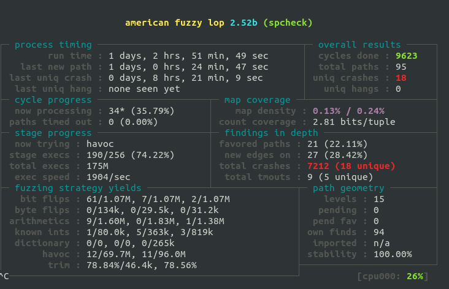
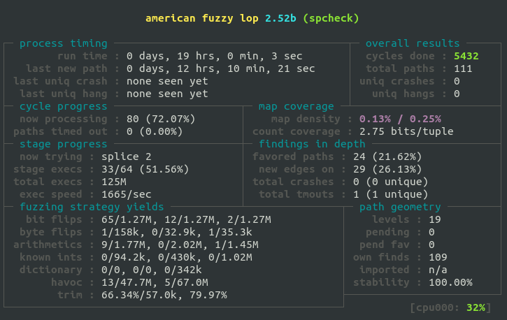

# SDS
### Authors
* Selim Lakhdar
* Jonathan Soleillet

### HOWTO
#### COMPIL
```
make spcheck
```
#### VALGRIND
```
make valgrind
```
#### FUZZING
```
make fuzzing
```

### Conception

From the sitff.h file we coded 4 functions;   
* stif_t *parse_stif(const unsigned char *buffer, size_t buffer_size) :
    *   This function is used to parse a stiff file.
    *   We performed several checks like;
        *  check magic
        *  check if the first block is a header block
        *  check if the width and the height are positive (>0)
        *  check color_type
        *  check that all remaning blocks, are data blocks (no multiple header)
        *  check that if the image is a Grayscale, the buffer size couldn't be greater than the buffer offset. (we read exactly the right size)
        *  check that if the image is a RGB, we should parse exactly 3 pixels (composants:RGB)

* stif_block_t *read_stif_block(const unsigned char *buffer, size_t buffer_size, size_t *bytes_read)
    * This function is used to parse a block.
    * We performed several checks like;
        * check minimal block size: 1 byte for type + 4 bytes for size of data.
        * check if the announced size is not negatif
        * check that if the block is a header block, it's size it's exactly 9 bytes {width + height + type}
        * check that if the block is a data block, it's size couldn't be grater than buffer offset (bytes_read+block_size < buffer_size)

* void stif_free(stif_t *s) :
	* This function is used to free the stif_t structure.
	* Using stif_block_free() function
	
* void stif_block_free(stif_block_t *b) :
	* Recursive function to free the block chain structure. 


* We ensure to make if_elseif_else condition format to catch all unexpected comportments.
* In the last phase of developpement, we changed all our assertion for the memory allocation check, to a simple if statement to avoid anormal exit.

### TOOLS

* Valgrind :
We used Valgrind tool to check memory leaks in each case (normal or error run)
* GDB :
We used GDB to help us to find where the program crash with some fuzz files.
* AFL :
We used AFL for fuzzing test (generate a lot of fuzzing file) and pass it to the spcheck program and verify if it crash.
#### Before :

#### After :


### Some improvement

* We can change the block size from int32_t to uint32_t. (no negative size)
* We can change the int32_t in stif_header_s to uint_32. Width and Height can't be negative.
* We can change the stif_s structure. Use anonymous union for pixel array.
